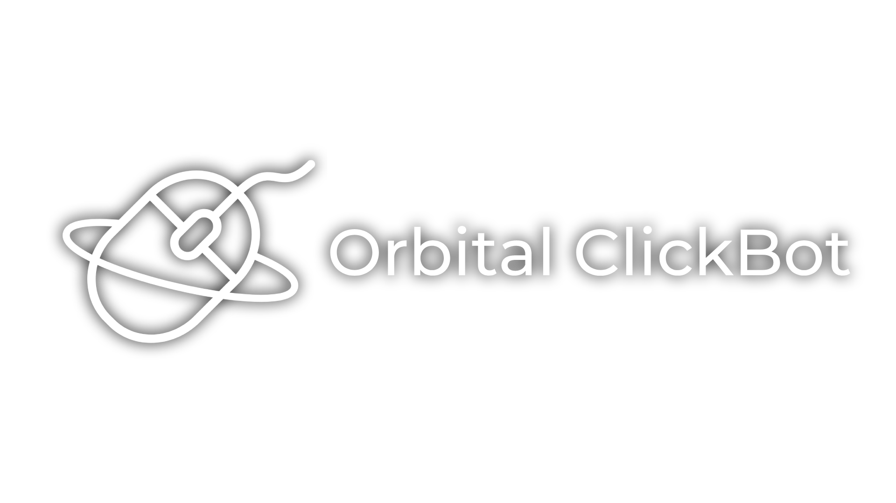

<hr>

GD ClickBot, continuation/rewrite of TCB++

## Quickstart

GUI version → download from [releases](https://github.com/thisisignitedoreo/orbitalcb/releases)<br/>
Console version → download from [releases](https://github.com/thisisignitedoreo/orbitalcb/releases), help is embedded in the executable

## For users

Currently supported macro formats:
- ReplayEngine
- GDR (GDMO Bot)
- TASBot
- xdBot

_Planned_:<br/>
- YBot (it just is too damn complicated, srsly, kepe, why???)
- some other 2.2 bots (do they even exist?)

Clickpacks can be either a folder or a zip with such structure:

```
clickpack/ # or
clickpack.zip
├─ bg-noise.wav    # mp3/ogg/flac is also supported
│                  # also optional
├─ p1/
│  ├─ softclicks/  # optional
│  │  ├─ holds/
│  │  ├─ releases/
│  ├─ hardclicks/  # optional
│  │  ├─ holds/
│  │  ├─ releases/
│  ├─ holds/
│  ├─ releases/
├─ p2/             # optional
│  ├─ softclicks/  # optional
│  │  ├─ holds/
│  │  ├─ releases/
│  ├─ hardclicks/  # optional
│  │  ├─ holds/
│  │  ├─ releases/
│  ├─ holds/
│  ├─ releases/
├─ meta.json
```

Notice `meta.json` file: it has some info like the name of the clickpack, author, and small description
which is shown right after clickpack was loaded. It is simple [JSON](https://en.wikipedia.org/wiki/JSON)
file with following structure:
```json
{
    "name": "Clickpack name",
    "description": "Clickpack description (i.e. soft and hard clicks, + background noise)",
    "author": "Clickpack author"
}
```
All of these can be ommited, they will be shown as unspecified.

## For developers

Clickbot is split into two parts: logic and interface.
Logic is a library on top of which you can write any interface you want.
This overcomes the problem with TCB++ in which I had a completly different console
version with its own separate logic. It was really hard to maintain.

Forks are allowed by the [LICENSE](/LICENSE) (GNU GPL v3 only) and are greatly
appreciated by me. Just follow the license (opensource your code under GPL v3 license).

Adding bot-parsers is as easy as adding such key-value pair to `macro_types` global:
> `("Human readable bot name", "Wildcard to match file with"): parse_function`

`parse_function` is function with signature `fn(macro_path: str) -> dict` and return such object:
> `{ "fps": MACRO_FPS (*int),`<br>
> `  "replay": [`<br>
> `    { "frame": ACTION_FRAME (*int), "hold": ACTION_ISHOLD (True, False), "player": ACTION_PLAYER (1, 2) },`<br>
> `    ... ] }`<br>

You can take a look at existing function for help.
